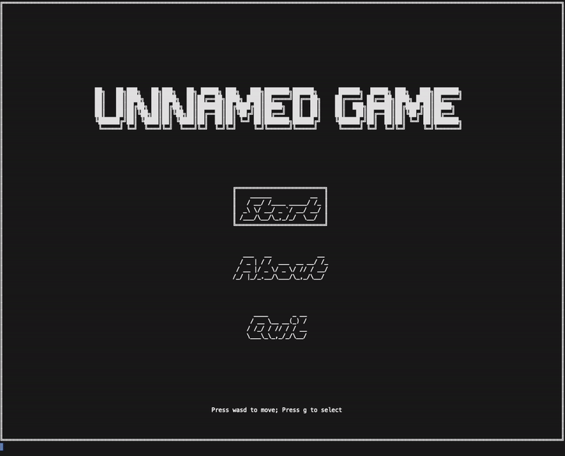

> 📢 More maps are coming out in **May**!

# Unnamed Game



## Team members

Li Han (3035845954) [@Kelios1556](https://github.com/Kelios1556)

Ye Yaowen (3035845344) [@HelloElwin](https://github.com/HelloElwin)

## Introduction

"Unnamed Game is a fun game without a name (yet)! And you, the bravest explorer in HKU, are given the job to find the name for this game! The name is hidden in a secrete room in a world of ice and flame, and your journey starts from a certain point in this world. At the end point lies the entrance of the secrete room and your ultimate goal: name for the Unnamed Game!"

This is a keyboard-based adventure game for one player controlled by **wasd**. The player is suggested to kick in a way to travel to the destination.

A list of features including portals, gravity switches, world converters etc., are designed to assist the travel. Two properties, ice and flame, are attached to the player, elfins and grounds. Under opposite properties, elfins and grounds may be dangerous to the player.

\[[Video Demonstration in Google Drive](https://drive.google.com/file/d/1Zh4KOynGt4oPI9joVerWWsWSWNrtcACP/view?usp=sharing)\]
\[[Video Demonstration in this repo](./pics/demonstration.mp4)\]

### Quick Start

Start the game with these commands!

Move the character with `wasd` and select with `g`. \[[Sample I/O](./sample/input_output_sample.pdf)\]

```bash
make clean
make main
./main
```

The game is tested in HKU CS `academy11` server. However, we strongly recommend you to run the game locally since the **network latency** may affect your gaming experience.

## Element description

### Air

The player will fall/float according the direction of gravity.

### Elfin

It can move in horizontal directions with a property of ice or flame. An elfin will move towards the player when the player arrives at the same level. If the player holds the same property as the elfin, the elfin is harmless. It will chase after you, or bounce around you, or fly towards you. Otherwise, if the player holds the opposite property as the elfin's, direct contacting means **Game Fails**.

### Gravity Switch

When the player reaches a Gravity Switch, the direction of gravity will be changed.

### Inner World

When the player enters a World Converter from the external world, the player will arrive in the inner world, and vice versa. The properties of some features (e.g., player, elfins, property grounds) may convert upon player's arrival.

### Portal

Portals, appearing in pairs, are distinguished by colors. When the player enters a portal from one side, the player will be sent to the same side of another portal with the same color.

### Property Ground

They differd from normal grounds as their specified properties. They may be attached with ice or flame as their own property, which might convert to the opposite properties in the inner world. If the player is with the same property as the ground, it can be treated as the normal ground. Otherwise, walking on the ground with the opposite property will result in **Game Fails**.

### World Converter

World converters usually have similar shapes with portals except that they do not appear in pairs. It means that if there's no other portal that is with the same color as this "portal", then it is a world converter. When it is a necessity to pass a block of property ground with the opposite property, or when facing the coming attack from a elfin with the opposite property, the player can enter the external/inner world through these world converters.  

## Features

1. Generation of random game sets or events

    * We use random seeds to decide the color of Portals and World-Converters. \[[link](./src/map.cpp#L153)\]

2. Data structures for storing game status

    * We design a class `Map` to store the information of the map. \[[link](./src/map.h#L31)\]
    * We design a class `Block` to store the information of blocks, i.e. ground, portals etc. \[[link](./src/map.h#L23)\]
    * We design a class `Player` to store the information of the player. \[[link](./src/player.h#L8)\]
    * We design a class `Elfin` to store the information of elfins. \[[link](./src/elfin.h#L10)\]
    
3. Dynamic memory management

    * We use a vector to store all the elfins in a specific map. When initializing a map, we push the elfin to the vector one by one. At the end of the game, we release all the stored elfins from the vector. \[[link](./src/block.h#L44)\]
    
4. File input/output

    * Before the game, the player needs to choose a map available. The program will read the choice, and the corresponding map file will be loaded from `/lib/maps`. \[[link](./src/map.cpp#L85)\]
    * When the program initializes a map, the corresponding templates of different blocks (E.G., portals, gates, grounds) and the elfin are loaded to fill the content of the map. \[[link](./src/block_fill.cpp#L47)\]
    * After the player wins a game, the success record will be saved to `pass.txt`. \[[link](./src/interface.cpp#L271)\]
    
5. Program codes in multiple files
      ```
      .
      ├── main
      ├── Makefile
      ├── README.md
      ├── src
      │   ├── *.cpp
      │   ├── *.h
      ├── bin
      │   ├── *.o
      ├── lib
      │   ├── blocks
      │   │   ├── *.txt (block models)
      │   └── maps
      │       ├── *.txt (maps)
      │       ├── conio.h
      │       ├── description.txt
      │       ├── format.txt
      │       ├── pass.txt
      ├── test
      │   ├── *.py/cpp (test programs)
      ├── pics
      ```

6. Implemented functions for game features

   **Map initialization**
   
   ```c++
   void Map::init(int map_num);
   ```

   **Map print**

   ```c++
   void Map::print(void);
   ```

   **Map update**
   
   ```c++
   void Map::update(Player u);
   ```
   
   **Map content fill**
   
   ```c++
   void fill(int overall, int *cont, int state);
   ```
   
   **Gravity inversion & portal and world-converter delivery**
   
   ```c++
   void Map::check(Player &u);
   ```
   
   **World Conversion**
   
   ```c++
   void Map::converter(Player &u);
   ```
   
   **Player initialization**
   
   ```c++
   void Player::init(int x0, int y0, int h0, int w0, int s0, int cont[][2], int proty);
   ```
   
   **Game status check**
   
   ```c++
   bool Player::alive(Map& map);
   bool Player::success(Map& map);
   ```
   
   **Player move**
   
   ```c++
   void Player::move(char direction, Map& map, bool& moving);
   ```
   
   **Elfin initialization**
   
   ```c++
   void Elfin::init(int x0; int y0, int h, int w, int cont[][6], int proty, int lel);
   ```
   
   **Elfin move**
   
   ```c++
   void elfin_move(Map& map, Player& player, bool& touch, bool& moving);
   ```
   
   **Window size reminder**
   
   ```c++
   void sizecheck(void);
   ```

## Non-standard libraries

* `termios.h` is used to monitor keyboard input

  ```c++
  #include <termios.h>
  struct termios;
  int txgetattr(int, struct termios *);
  int tcsetattr(int, int, struct termios *);
  ```

* `sys/ioctl.h` is used to get the row and column of the window

  ```c++
  #include <sys/ioctl.h>
  struct winsize;
  ioctl(int, usigned long, struct winsize *);
  ```

* `conio.h` is used to determine whether a key has been pressed or not

  ```c++
  #include <conio.h>
  int kbhit(void);
  ```


